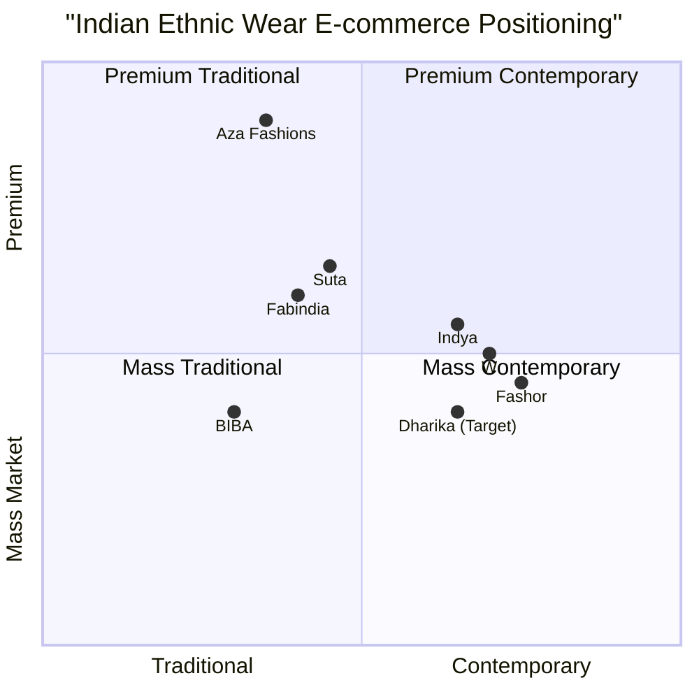

# Dharika: Comprehensive Product Requirements Document (PRD)

## Table of Contents

1. [Executive Summary](#executive-summary)
2. [Market Research](#market-research)
   - [Market Size & Growth](#market-size--growth)
   - [Target Audience Analysis](#target-audience-analysis)
   - [Competitive Landscape](#competitive-landscape)
   - [Industry Trends](#industry-trends)
   - [Competitive Quadrant Chart](#competitive-quadrant-chart)
3. [Product Vision & Strategy](#product-vision--strategy)
   - [Brand Positioning](#brand-positioning)
   - [Value Proposition](#value-proposition)
   - [Product Goals](#product-goals)
   - [Success Metrics](#success-metrics)
4. [User Requirements](#user-requirements)
   - [User Personas](#user-personas)
   - [User Stories](#user-stories)
   - [User Journeys](#user-journeys)
5. [Technical Specifications](#technical-specifications)
   - [Technology Stack Overview](#technology-stack-overview)
   - [System Architecture](#system-architecture)
   - [Data Structure & Schemas](#data-structure--schemas)
   - [API Requirements](#api-requirements)
   - [Security Requirements](#security-requirements)
6. [Functional Requirements](#functional-requirements)
   - [E-commerce Core Features](#e-commerce-core-features)
   - [Authentication & User Management](#authentication--user-management)
   - [Community & Engagement Features](#community--engagement-features)
   - [Marketing & Communication Tools](#marketing--communication-tools)
   - [Admin & CMS Capabilities](#admin--cms-capabilities)
7. [Non-Functional Requirements](#non-functional-requirements)
   - [Performance](#performance)
   - [Scalability](#scalability)
   - [Usability](#usability)
   - [Reliability](#reliability)
   - [Compatibility](#compatibility)
8. [UI/UX Design Guidelines](#uiux-design-guidelines)
   - [Brand Visual Identity](#brand-visual-identity)
   - [User Interface Elements](#user-interface-elements)
   - [Responsive Design Guidelines](#responsive-design-guidelines)
9. [Implementation Roadmap](#implementation-roadmap)
   - [Development Phases](#development-phases)
   - [Feature Prioritization](#feature-prioritization)
   - [Timeline & Milestones](#timeline--milestones)
10. [Risk Assessment & Mitigation](#risk-assessment--mitigation)
11. [Appendices](#appendices)

## Executive Summary

Dharika is a women-led, Indian ethnic wear e-commerce brand targeting budget-conscious Gen Z and millennial audiences across India. The brand seeks to blend traditional aesthetics with modern sensibilities, creating a unique shopping experience that goes beyond transaction to build community and brand loyalty.

This comprehensive Product Requirements Document (PRD) outlines the detailed specifications for the Dharika e-commerce platform, incorporating market research insights and technical specifications for implementation. The platform will be launched by June 30, 2025, with core functionalities that enable seamless shopping experience while fostering community engagement through innovative features like collaborative wishlists, AI styling assistants, and gamification elements.

The document provides developers with in-depth technical specifications for each feature, ensuring clarity on implementation requirements, data structures, API specifications, and integration points. It also outlines the phased delivery approach to ensure timely launch while prioritizing critical features.

## Market Research

### Market Size & Growth

The Indian ethnic wear market represents a substantial and growing opportunity for new entrants like Dharika:

- **Current Market Valuation**: The Indian ethnic wear market is valued at approximately USD 197.2 billion in 2024, with some estimates ranging between USD 108-115 billion depending on segment definitions.

- **E-commerce Segment**: The fashion e-commerce market in India is valued at USD 21.60 billion in 2025, with ethnic wear being a significant component. Approximately 35% of total ethnic apparel sales now occur through e-commerce platforms.

- **Growth Projections**: The market is projected to grow at a CAGR of 6.9-12.6% from 2024 to 2033, potentially reaching USD 558.5 billion by 2033.

- **Market Drivers**:
  - Rising disposable incomes and urbanization
  - Growing preference for traditional wear among younger generations
  - Increasing internet and smartphone penetration (approximately 50% in 2025)
  - Growing influence of social media and Bollywood on fashion trends
  - Rise of fusion wear blending traditional and contemporary designs

This robust market presents a significant opportunity for Dharika to establish itself as a distinctive player in the women's ethnic wear e-commerce space, particularly with its focus on budget-conscious Gen Z and millennial audiences.

### Target Audience Analysis

The target audience for Dharika consists primarily of Gen Z and millennial women in India who have distinct shopping behaviors and preferences:

#### Demographic Profile
- **Primary**: Indian women aged 18-35
- **Income Level**: Middle-income, budget-conscious consumers
- **Geographic Distribution**: Tier 1 and Tier 2 cities across India
- **Digital Behavior**: Mobile-first, active on Instagram and WhatsApp

#### Shopping Behaviors

1. **Digital-First Approach**
   - Gen Z and millennials discover and purchase ethnic wear primarily through social media platforms and e-commerce
   - Heavily influenced by social media content and influencer recommendations
   - Comfortable with mobile shopping experiences

2. **Value-Driven Priorities**
   - Seek brands that align with personal values, particularly sustainability and ethical production
   - 50% increase in demand for sustainable fabrics and eco-friendly production methods
   - Expect transparent pricing and value for money

3. **Fashion Preferences**
   - Over 50% prefer modernized ethnic wear with contemporary elements
   - Popular fusion styles include indo-western gowns, dhoti sarees, and kurtas with modern styling
   - Emphasis on comfort-first fashion with relaxed fits and versatile layering options
   - Interest in customization and personalization of traditional pieces

4. **Purchase Triggers**
   - Cultural events, weddings, and festivals remain key purchase drivers
   - Trend-based buying influenced by social media and celebrity styles
   - Community validation through peer reviews and recommendations

Understanding these characteristics will guide Dharika's product selection, marketing strategies, and feature development to create a platform that resonates with this target audience.

### Competitive Landscape

The Indian ethnic wear e-commerce market features several established players across different segments. Understanding this competitive landscape will help position Dharika effectively:

#### Key Competitors

1. **Aza Fashions**
   - **Founded**: 2005
   - **Funding**: $7.07 million
   - **Positioning**: Premium multi-designer retail chain offering bridal, couture, and prêt collections
   - **Strengths**: Luxury positioning, established designer relationships
   - **Weaknesses**: Higher price points, less appeal to budget-conscious consumers

2. **Fashor**
   - **Founded**: 2017
   - **Funding**: $6.23 million (including $2.34 million seed round in June 2024)
   - **Positioning**: Internet-first brand focused on women's ethnic wear
   - **Strengths**: Strong mobile presence with dedicated apps, contemporary designs
   - **Weaknesses**: Limited community engagement features

3. **Fabindia**
   - **Founded**: 1960
   - **Funding**: $57.2 million
   - **Positioning**: Community-owned company producing sustainable ethnic wear
   - **Strengths**: Strong brand recognition, sustainability focus
   - **Weaknesses**: Traditional aesthetic may appeal less to younger consumers seeking fusion styles

4. **W (TCNS Clothing)**
   - **Founded**: 2003
   - **Funding**: $11.8 million
   - **Positioning**: Contemporary ready-to-wear apparel for urban Indian women
   - **Strengths**: Extensive physical retail presence (160+ exclusive outlets)
   - **Weaknesses**: Less digital-native experience compared to newer entrants

5. **Indya**
   - **Positioning**: Multi-channel fashion brand offering traditional and contemporary ethnic wear
   - **Strengths**: Diverse product range including accessories and jewelry
   - **Weaknesses**: Less focused positioning compared to specialized competitors

6. **Other Notable Players**: BIBA Apparels, Suta, Koskii, House of Chikankari, Libas

#### Competitive Differentiation

Dharika can differentiate itself from competitors through:

1. **Community-Centric Approach**: While most competitors focus primarily on transactions, Dharika emphasizes community building through collaborative wishlists and user-generated content.

2. **Budget-Conscious Positioning**: Target the underserved middle-market between premium players like Aza and mass-market brands like BIBA.

3. **Tech-Forward Features**: Interactive elements like AI styling assistants and gamification provide a unique experience compared to traditional e-commerce interfaces.

4. **Modern Aesthetic with Traditional Roots**: Focus on fusion styles that appeal to younger consumers while honoring traditional craftsmanship.

5. **Mobile-First Experience**: Optimized for the primary shopping device of the target audience.

### Industry Trends

The Indian ethnic wear e-commerce market is evolving rapidly, with several key trends that Dharika should consider:

1. **Fusion Wear Dominance**
   - 50% of Gen Z consumers favor fusion styles that blend traditional designs with modern elements
   - Growing demand for versatile ethnic pieces that can be styled in multiple ways

2. **Sustainability Focus**
   - 50% increase in demand for sustainable fabrics and eco-friendly production
   - Rising interest in traditional craftsmanship and artisanal production methods

3. **Technology Integration**
   - AI-driven personalization with 25% sales boost via AI styling tools
   - 20% adoption of augmented reality try-on solutions
   - Social commerce features enabling direct purchasing from influencer content

4. **Omnichannel Approach**
   - Leading brands integrating online platforms with physical stores
   - Click-and-collect options growing in popularity

5. **Direct-to-Consumer Models**
   - 30% growth in D2C ethnic wear brands
   - Emphasis on brand storytelling and direct customer relationships

6. **Social Commerce**
   - Shopping directly through social media platforms
   - User-generated content driving purchase decisions

7. **Personalization**
   - Custom sizing and style recommendations based on user preferences
   - Customization options for products

By incorporating these trends into its platform design, Dharika can create a forward-looking shopping experience that appeals to its target audience.

### Competitive Quadrant Chart

This quadrant chart illustrates Dharika's target positioning in relation to key competitors. Dharika aims to occupy the "Mass Contemporary" quadrant with a slight premium edge, focusing on contemporary ethnic wear at accessible price points. This positioning differentiates it from premium players like Aza Fashions while offering a more contemporary aesthetic than traditional players like BIBA.

## Product Vision & Strategy

### Brand Positioning

Dharika positions itself as a women-led, Indian ethnic wear e-commerce brand that bridges traditional aesthetics with modern sensibilities. The brand's key positioning elements include:

- **Target Market**: Budget-conscious Gen Z and millennial women (18-35) in urban and semi-urban India
- **Price Point**: Mid-range pricing, offering quality ethnic wear at accessible price points
- **Aesthetic**: Contemporary fusion of traditional Indian designs with modern styling
- **Personality**: Feminine, elegant, playful, and culturally rooted
- **Differentiator**: Community-centric shopping experience that goes beyond transactions

This positioning creates a unique space in the market between premium designer outlets and mass-market retailers, appealing specifically to younger consumers seeking stylish ethnic wear that reflects both their cultural heritage and contemporary fashion sensibilities.

### Value Proposition

Dharika offers a distinctive value proposition to its target audience:

1. **Curated Selection**: Thoughtfully selected ethnic wear collections that blend traditional aesthetics with contemporary style at accessible price points

2. **Community Experience**: A shopping platform that fosters connection through shared wishlists, user-generated content, and social shopping features

3. **Personalized Discovery**: AI-powered styling recommendations and interactive experiences that help customers discover products suited to their preferences

4. **Engagement Beyond Transactions**: Fun, interactive elements like games and style quizzes that create brand affinity beyond the purchase journey

5. **Mobile-First Convenience**: Optimized shopping experience for the primary device used by the target audience

This value proposition addresses the key needs of the target audience: affordable style, community validation, personalized experiences, and mobile convenience.

### Product Goals

The Dharika e-commerce platform has three primary goals:

1. **Create a Seamless Shopping Experience**
   - Develop an intuitive, mobile-optimized e-commerce platform that facilitates efficient product discovery and purchase
   - Implement personalized product recommendations and search functionality
   - Provide clear, detailed product information and visuals to support purchase decisions
   - Optimize the checkout process to minimize friction and cart abandonment

2. **Foster Community Engagement**
   - Enable social shopping experiences through collaborative wishlists and shared collections
   - Incorporate user-generated content through customer-submitted lookbooks
   - Facilitate product discovery through peer recommendations and social validation
   - Create interactive touchpoints that encourage repeated engagement with the brand

3. **Drive Customer Acquisition and Retention**
   - Implement features that encourage social sharing and word-of-mouth promotion
   - Incorporate gamification elements to incentivize return visits
   - Support marketing initiatives through integrated communication tools
   - Build a platform that scales to accommodate business growth and evolving customer needs

These goals align with the brand positioning and value proposition, focusing on creating a distinctive shopping experience that resonates with the target audience.

### Success Metrics

To measure the platform's success in achieving its goals, the following key performance indicators (KPIs) will be tracked:

#### User Acquisition Metrics
- **User Growth**: Target of 1,000+ registered users within 30 days of launch
- **Conversion Rate**: Achieve 3%+ visitor-to-customer conversion rate
- **Customer Acquisition Cost (CAC)**: Keep below 20% of average order value
- **Traffic Sources**: Track effectiveness of different acquisition channels

#### Engagement Metrics
- **Session Duration**: Average session time > 2 minutes
- **Pages per Session**: Average of 4+ pages viewed per session
- **Wishlist Collaboration Rate**: 5%+ of wishlists shared with others
- **Game Participation**: 10%+ of users engage with mini-game
- **Return Rate**: >15% return visits within 30 days

#### Revenue Metrics
- **Average Order Value (AOV)**: Target of ₹2,000+
- **Revenue Growth**: 20%+ month-over-month growth in first quarter
- **Category Performance**: Track sales distribution across product categories
- **Affiliate Sales**: Monitor revenue through affiliate channels

#### Technical Performance Metrics
- **Page Load Time**: Under 2 seconds on mobile devices
- **Cart Abandonment Rate**: Below industry average of 70%
- **Checkout Completion Time**: Under 2 minutes
- **Mobile vs. Desktop Usage**: Track platform preference

These metrics will be monitored through analytics tools integrated with the platform, with regular reporting to track progress toward goals.

## User Requirements

### User Personas

To guide the development of Dharika's e-commerce platform, we've developed key user personas that represent our target audience segments:

#### Persona 1: Neha - The Urban Professional

**Demographics:**
- 28 years old
- Marketing executive at an MNC
- Lives in Bangalore
- Income: ₹10-12 LPA

**Behaviors:**
- Shops online 2-3 times per month
- Primarily uses smartphone for shopping
- Active on Instagram and Pinterest
- Values quality and uniqueness

**Goals:**
- Find fusion ethnic wear suitable for office and casual outings
- Discover unique pieces that stand out
- Shop efficiently with minimal time investment

**Pain Points:**
- Limited time for shopping
- Difficulty finding pieces that balance professionalism and style
- Concerns about fit and quality when shopping online

#### Persona 2: Riya - The College Student

**Demographics:**
- 21 years old
- Undergraduate student
- Lives in Delhi
- Limited budget, primarily uses pocket money

**Behaviors:**
- Very active on social media, especially Instagram and WhatsApp
- Influenced by peers and social media trends
- Price-sensitive but style-conscious
- Shares shopping experiences with friends

**Goals:**
- Find affordable trendy ethnic wear for college events
- Discover styles similar to those worn by influencers
- Share and get feedback on potential purchases from friends

**Pain Points:**
- Limited budget
- Wants trendy designs at affordable prices
- Overwhelmed by too many options

#### Persona 3: Priya - The Occasional Shopper

**Demographics:**
- 32 years old
- School teacher
- Lives in Pune
- Income: ₹6-8 LPA

**Behaviors:**
- Shops primarily for specific occasions (festivals, weddings)
- More comfortable with traditional designs
- Values recommendations and reviews
- Moderate technology comfort level

**Goals:**
- Find appropriate ethnic wear for special occasions
- Get styling advice for complete looks
- Ensure reliable delivery for time-sensitive purchases

**Pain Points:**
- Difficulty visualizing how items will look
- Concerns about delivery timeliness for event-specific shopping
- Less confident in making style decisions independently

### User Stories

Based on these personas, we've identified key user stories to address their needs and pain points:

#### Shopping Experience

1. **Product Discovery**
   - As a busy professional like Neha, I want efficient filtering and search options so that I can quickly find products that match my requirements.
   - As a style-conscious student like Riya, I want trend-based collections and lookbooks so that I can discover the latest fashion without extensive searching.
   - As an occasional shopper like Priya, I want occasion-based categorization so that I can easily find appropriate outfits for specific events.

2. **Product Evaluation**
   - As a quality-conscious shopper, I want multiple high-resolution images and videos of products so that I can assess details and craftsmanship before purchasing.
   - As someone concerned about fit, I want detailed size guides and measurements so that I can select the right size confidently.
   - As a budget-conscious student, I want clear pricing information and the ability to sort by price so that I can shop within my budget.

3. **Purchase Process**
   - As a mobile user, I want a streamlined checkout process so that I can complete purchases quickly without frustration.
   - As a cautious online shopper, I want secure payment options including COD so that I feel comfortable making transactions.
   - As someone shopping for time-sensitive events, I want clear delivery timelines so that I know when to expect my order.

#### Community Features

1. **Social Shopping**
   - As a socially connected shopper like Riya, I want to create and share wishlists with friends so that I can get their opinions before purchasing.
   - As someone who values validation, I want to see user-generated content showing real people wearing the products so that I can better imagine how they might look on me.
   - As an occasional shopper like Priya, I want to see styling suggestions from other customers so that I can get ideas for complete outfits.

2. **Engagement**
   - As a young user like Riya, I want interactive elements like games and quizzes so that shopping feels fun and engaging.
   - As a regular online shopper like Neha, I want a personalized experience based on my preferences so that product discovery becomes more efficient over time.
   - As someone new to fusion fashion, I want styling advice from an AI assistant so that I can explore new looks with confidence.

### User Journeys

To illustrate how users will interact with the Dharika platform, we've mapped out key user journeys:

#### Journey 1: New User Discovery & First Purchase

1. **Acquisition**
   - User discovers Dharika through Instagram advertisement
   - Clicks through to website and lands on homepage

2. **Exploration**
   - Browses featured collections on homepage
   - Uses category navigation to explore "90s Glam" collection
   - Filters products by size and price range

3. **Engagement**
   - Views product details for a kurta set
   - Reads product descriptions and reviews
   - Checks size guide
   - Adds item to wishlist

4. **Consideration**
   - Takes style quiz recommended on product page
   - Receives personalized recommendations
   - Shares wishlist with friend via WhatsApp
   - Receives friend's feedback through collaborative wishlist

5. **Conversion**
   - Returns to wishlist and moves item to cart
   - Proceeds to checkout
   - Creates account during checkout process
   - Completes purchase using Razorpay

6. **Post-Purchase**
   - Receives order confirmation email
   - Gets WhatsApp notification when order ships
   - Returns to site to check order status

#### Journey 2: Returning User & Community Engagement

1. **Return Visit**
   - User receives email about new collection launch
   - Clicks through and logs in to account

2. **Personalized Experience**
   - Views personalized recommendations on homepage
   - Checks notification about friend's activity on shared wishlist

3. **Community Interaction**
   - Browses lookbook submissions from other customers
   - Uploads own photo to lookbook for recent purchase
   - Reacts to other users' submissions

4. **Gamification**
   - Plays mini-game to earn discount coupon
   - Checks position on monthly leaderboard

5. **Re-engagement**
   - Adds new items to wishlist
   - Shares wishlist with friends
   - Returns later based on friend's additions to collaborative wishlist

These user journeys illustrate the interconnected nature of the shopping and community features, showing how the platform creates multiple touchpoints for engagement beyond simple transactions.

