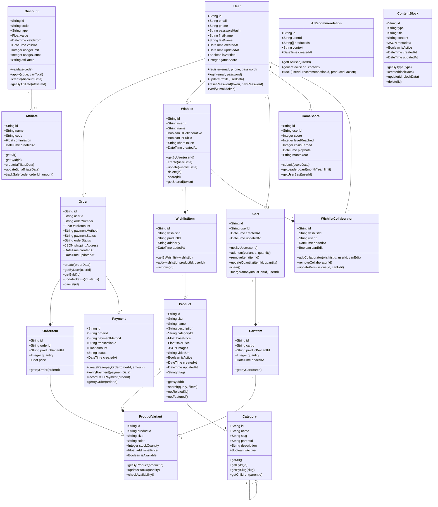

```mermaid
  classDiagram
    class User {
        +String id
        +String email
        +String phone
        +String passwordHash
        +String firstName
        +String lastName
        +DateTime createdAt
        +DateTime updatedAt
        +Boolean isVerified
        +Integer gameScore
        +register(email, phone, password)
        +login(email, password)
        +updateProfile(userData)
        +resetPassword(token, newPassword)
        +verifyEmail(token)
    }

    class Product {
        +String id
        +String sku
        +String name
        +String description
        +String categoryId
        +Float basePrice
        +Float salePrice
        +JSON images
        +String videoUrl
        +Boolean isActive
        +DateTime createdAt
        +DateTime updatedAt
        +String[] tags
        +getById(id)
        +search(query, filters)
        +getRelated(id)
        +getFeatured()
    }

    class ProductVariant {
        +String id
        +String productId
        +String size
        +String color
        +Integer stockQuantity
        +Float additionalPrice
        +Boolean isAvailable
        +getByProduct(productId)
        +updateStock(quantity)
        +checkAvailability()
    }

    class Category {
        +String id
        +String name
        +String slug
        +String parentId
        +String description
        +Boolean isActive
        +getAll()
        +getById(id)
        +getBySlug(slug)
        +getChildren(parentId)
    }

    class Cart {
        +String id
        +String userId
        +DateTime createdAt
        +DateTime updatedAt
        +getByUser(userId)
        +addItem(variantId, quantity)
        +removeItem(itemId)
        +updateQuantity(itemId, quantity)
        +clear()
        +merge(anonymousCartId, userId)
    }

    class CartItem {
        +String id
        +String cartId
        +String productVariantId
        +Integer quantity
        +DateTime addedAt
        +getByCart(cartId)
    }

    class Wishlist {
        +String id
        +String userId
        +String name
        +Boolean isCollaborative
        +Boolean isPublic
        +String shareToken
        +DateTime createdAt
        +getByUser(userId)
        +create(userData)
        +update(wishlistData)
        +delete(id)
        +share(id)
        +getShared(token)
    }

    class WishlistItem {
        +String id
        +String wishlistId
        +String productId
        +String addedBy
        +DateTime addedAt
        +getByWishlist(wishlistId)
        +add(wishlistId, productId, userId)
        +remove(id)
    }

    class WishlistCollaborator {
        +String id
        +String wishlistId
        +String userId
        +DateTime addedAt
        +Boolean canEdit
        +addCollaborator(wishlistId, userId, canEdit)
        +removeCollaborator(id)
        +updatePermissions(id, canEdit)
    }

    class Order {
        +String id
        +String userId
        +String orderNumber
        +Float totalAmount
        +String paymentMethod
        +String paymentStatus
        +String orderStatus
        +JSON shippingAddress
        +DateTime createdAt
        +DateTime updatedAt
        +create(orderData)
        +getByUser(userId)
        +getById(id)
        +updateStatus(id, status)
        +cancel(id)
    }

    class OrderItem {
        +String id
        +String orderId
        +String productVariantId
        +Integer quantity
        +Float price
        +getByOrder(orderId)
    }

    class Payment {
        +String id
        +String orderId
        +String paymentMethod
        +String transactionId
        +Float amount
        +String status
        +DateTime createdAt
        +createRazorpayOrder(orderId, amount)
        +verifyPayment(paymentData)
        +recordCODPayment(orderId)
        +getByOrder(orderId)
    }

    class GameScore {
        +String id
        +String userId
        +Integer score
        +Integer levelReached
        +Integer coinsEarned
        +DateTime playDate
        +String monthYear
        +submit(scoreData)
        +getLeaderboard(monthYear, limit)
        +getUserBest(userId)
    }

    class Discount {
        +String id
        +String code
        +String type
        +Float value
        +DateTime validFrom
        +DateTime validTo
        +Integer usageLimit
        +Integer usageCount
        +String affiliateId
        +validate(code)
        +apply(code, cartTotal)
        +create(discountData)
        +getByAffiliate(affiliateId)
    }

    class AiRecommendation {
        +String id
        +String userId
        +String[] productIds
        +String context
        +DateTime createdAt
        +getForUser(userId)
        +generate(userId, context)
        +track(userId, recommendationId, productId, action)
    }

    class ContentBlock {
        +String id
        +String type
        +String title
        +String content
        +JSON metadata
        +Boolean isActive
        +DateTime createdAt
        +DateTime updatedAt
        +getByType(type)
        +create(blockData)
        +update(id, blockData)
        +delete(id)
    }

    class Affiliate {
        +String id
        +String name
        +String code
        +Float commission
        +DateTime createdAt
        +getAll()
        +getById(id)
        +create(affiliateData)
        +update(id, affiliateData)
        +trackSale(code, orderId, amount)
    }

    User "1" --o "*" Order
    User "1" --o "*" Wishlist
    User "1" --o "1" Cart
    User "1" --o "*" GameScore
    Product "1" --* "*" ProductVariant
    Product "*" --o "1" Category
    Category "1" --o "*" Category
    Cart "1" --* "*" CartItem
    CartItem "*" --o "1" ProductVariant
    Wishlist "1" --* "*" WishlistItem
    WishlistItem "*" --o "1" Product
    Wishlist "1" --* "*" WishlistCollaborator
    WishlistCollaborator "*" --o "1" User
    Order "1" --* "*" OrderItem
    OrderItem "*" --o "1" ProductVariant
    Order "1" --o "*" Payment
    Discount "*" --o "0..1" Affiliate
```
