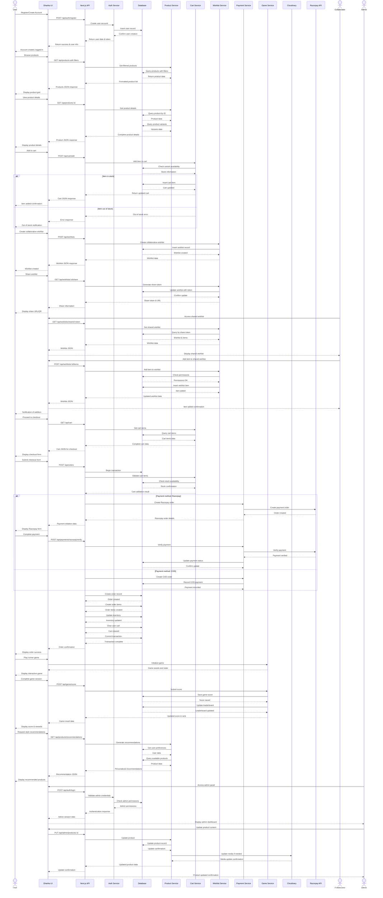

```mermaid
  sequenceDiagram
    actor User
    participant UI as Dharika UI
    participant API as Next.js API
    participant Auth as Auth Service
    participant DB as Database
    participant ProductService as Product Service
    participant CartService as Cart Service
    participant WishlistService as Wishlist Service
    participant PaymentService as Payment Service
    participant GameService as Game Service
    participant Storage as Cloudinary
    participant RazorPay as Razorpay API

    %% User Registration Flow
    User->>UI: Register/Create Account
    UI->>API: POST /api/auth/register
    API->>Auth: Create user account
    Auth->>DB: Insert user record
    DB-->>Auth: Confirm user creation
    Auth-->>API: Return user data & token
    API-->>UI: Return success & user info
    UI-->>User: Account created, logged in

    %% Product Browsing Flow
    User->>UI: Browse products
    UI->>API: GET /api/products with filters
    API->>ProductService: Get filtered products
    ProductService->>DB: Query products with filters
    DB-->>ProductService: Return product data
    ProductService-->>API: Formatted product list
    API-->>UI: Products JSON response
    UI-->>User: Display product grid

    %% Product Detail Flow
    User->>UI: View product details
    UI->>API: GET /api/products/:id
    API->>ProductService: Get product details
    ProductService->>DB: Query product by ID
    DB-->>ProductService: Product data
    ProductService->>DB: Query product variants
    DB-->>ProductService: Variants data
    ProductService-->>API: Complete product details
    API-->>UI: Product JSON response
    UI-->>User: Display product details

    %% Add to Cart Flow
    User->>UI: Add to cart
    UI->>API: POST /api/cart/add
    API->>CartService: Add item to cart
    CartService->>DB: Check variant availability
    DB-->>CartService: Stock information
    alt Item in stock
        CartService->>DB: Insert cart item
        DB-->>CartService: Cart updated
        CartService-->>API: Return updated cart
        API-->>UI: Cart JSON response
        UI-->>User: Item added confirmation
    else Item out of stock
        CartService-->>API: Out of stock error
        API-->>UI: Error response
        UI-->>User: Out of stock notification
    end

    %% Wishlist Collaboration Flow
    User->>UI: Create collaborative wishlist
    UI->>API: POST /api/wishlists
    API->>WishlistService: Create collaborative wishlist
    WishlistService->>DB: Insert wishlist record
    DB-->>WishlistService: Wishlist created
    WishlistService-->>API: Wishlist data
    API-->>UI: Wishlist JSON response
    UI-->>User: Wishlist created
    
    User->>UI: Share wishlist
    UI->>API: GET /api/wishlists/:id/share
    API->>WishlistService: Generate share token
    WishlistService->>DB: Update wishlist with token
    DB-->>WishlistService: Confirm update
    WishlistService-->>API: Share token & URL
    API-->>UI: Share information
    UI-->>User: Display share URL/QR

    %% Collaborator Flow
    actor Collaborator
    Collaborator->>UI: Access shared wishlist
    UI->>API: GET /api/wishlists/shared/:token
    API->>WishlistService: Get shared wishlist
    WishlistService->>DB: Query by share token
    DB-->>WishlistService: Wishlist & items
    WishlistService-->>API: Wishlist data
    API-->>UI: Wishlist JSON
    UI-->>Collaborator: Display shared wishlist
    
    Collaborator->>UI: Add item to shared wishlist
    UI->>API: POST /api/wishlists/:id/items
    API->>WishlistService: Add item to wishlist
    WishlistService->>DB: Check permissions
    DB-->>WishlistService: Permissions OK
    WishlistService->>DB: Insert wishlist item
    DB-->>WishlistService: Item added
    WishlistService-->>API: Updated wishlist data
    API-->>UI: Wishlist JSON
    UI-->>Collaborator: Item added confirmation
    UI-->>User: Notification of addition

    %% Checkout Flow
    User->>UI: Proceed to checkout
    UI->>API: GET /api/cart
    API->>CartService: Get cart items
    CartService->>DB: Query cart items
    DB-->>CartService: Cart items data
    CartService-->>API: Complete cart data
    API-->>UI: Cart JSON for checkout
    UI-->>User: Display checkout form
    
    User->>UI: Submit checkout form
    UI->>API: POST /api/orders
    API->>DB: Begin transaction
    API->>CartService: Validate cart items
    CartService->>DB: Check stock availability
    DB-->>CartService: Stock confirmation
    CartService-->>API: Cart validation result
    
    alt Payment method: Razorpay
        API->>PaymentService: Create Razorpay order
        PaymentService->>RazorPay: Create payment order
        RazorPay-->>PaymentService: Order created
        PaymentService-->>API: Razorpay order details
        API-->>UI: Payment initiation data
        UI-->>User: Display Razorpay form
        
        User->>UI: Complete payment
        UI->>API: POST /api/payments/razorpay/verify
        API->>PaymentService: Verify payment
        PaymentService->>RazorPay: Verify payment
        RazorPay-->>PaymentService: Payment verified
        PaymentService->>DB: Update payment status
        DB-->>PaymentService: Confirm update
    else Payment method: COD
        API->>PaymentService: Create COD order
        PaymentService->>DB: Record COD payment
        DB-->>PaymentService: Payment recorded
    end
    
    API->>DB: Create order record
    DB-->>API: Order created
    API->>DB: Create order items
    DB-->>API: Order items created
    API->>DB: Update inventory
    DB-->>API: Inventory updated
    API->>DB: Clear user cart
    DB-->>API: Cart cleared
    API->>DB: Commit transaction
    DB-->>API: Transaction complete
    API-->>UI: Order confirmation
    UI-->>User: Display order success

    %% Game Flow
    User->>UI: Play runner game
    UI->>GameService: Initialize game
    GameService-->>UI: Game assets and state
    UI-->>User: Display interactive game
    
    User->>UI: Complete game session
    UI->>API: POST /api/game/score
    API->>GameService: Submit score
    GameService->>DB: Save game score
    DB-->>GameService: Score saved
    GameService->>DB: Update leaderboard
    DB-->>GameService: Leaderboard updated
    GameService-->>API: Updated score & rank
    API-->>UI: Game result data
    UI-->>User: Display score & rewards
    
    %% AI Recommendation Flow
    User->>UI: Request style recommendations
    UI->>API: GET /api/products/recommendations
    API->>ProductService: Generate recommendations
    ProductService->>DB: Get user preferences
    DB-->>ProductService: User data
    ProductService->>DB: Query available products
    DB-->>ProductService: Product data
    ProductService-->>API: Personalized recommendations
    API-->>UI: Recommendation JSON
    UI-->>User: Display recommended products

    %% Admin Content Management Flow
    actor Admin
    Admin->>UI: Access admin panel
    UI->>API: POST /api/auth/login
    API->>Auth: Validate admin credentials
    Auth->>DB: Check admin permissions
    DB-->>Auth: Admin permissions
    Auth-->>API: Authentication response
    API-->>UI: Admin session data
    UI-->>Admin: Display admin dashboard
    
    Admin->>UI: Update product content
    UI->>API: PUT /api/admin/products/:id
    API->>ProductService: Update product
    ProductService->>DB: Update product record
    DB-->>ProductService: Update confirmation
    ProductService->>Storage: Update media if needed
    Storage-->>ProductService: Media update confirmation
    ProductService-->>API: Updated product data
    API-->>UI: Update confirmation
    UI-->>Admin: Product updated confirmation
```
