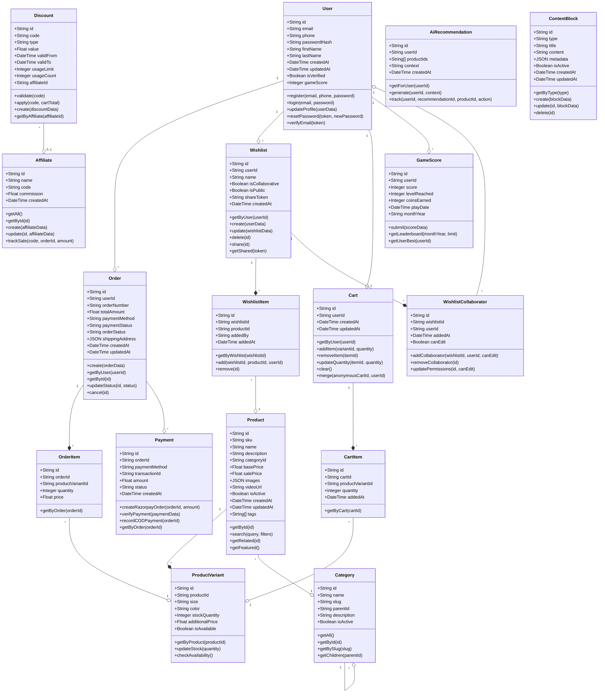

# Dharika E-commerce Platform - System Design Document

## 1. Implementation Approach

After analyzing the requirements for the Dharika e-commerce platform, we've identified several key aspects that need careful consideration:

### 1.1 Critical Technical Challenges

1. **Collaborative Wishlist System** - Creating a real-time, shareable wishlist with collaborative features requires careful implementation of permissions and synchronization.
2. **AI-Powered Recommendations** - Building a recommendation engine that suggests products based on user preferences while ensuring only in-stock items are shown.
3. **Interactive Game Integration** - Implementing a brand-themed runner game with leaderboard and reward system.
4. **Mobile-First Experience** - Ensuring optimal performance and user experience across various devices, particularly mobile.
5. **E-commerce Fundamentals** - Core shopping functionality including product filtering, cart persistence, and checkout flow.
6. **CMS for Internal Team** - Lightweight content management system for non-technical staff.

### 1.2 Technology Stack Selection

**Frontend:**
- **Framework**: Next.js (v14) with App Router - for server-side rendering, SEO optimization, and modern React features
- **UI Components**: Shadcn-UI - provides accessible, customizable components that align with the brand aesthetic
- **Styling**: Tailwind CSS - for efficient, responsive design with custom theming capabilities
- **State Management**: Zustand - lightweight state management for client-side state
- **Form Handling**: React Hook Form with Zod - for efficient, type-safe form validation
- **Game Engine**: Phaser.js - established 2D game development framework for the runner game

**Backend:**
- **Framework**: Next.js API routes - simplifies deployment and reduces infrastructure complexity
- **Database**: PostgreSQL - robust relational database for structured e-commerce data
- **ORM**: Prisma - type-safe database client with excellent TypeScript integration
- **Authentication**: NextAuth.js - flexible auth solution supporting multiple providers (Google, Phone/OTP)
- **File Storage**: Cloudinary - optimized cloud storage for product images and videos
- **Payment Processing**: Razorpay SDK - native integration for Indian payment methods

**DevOps:**
- **Hosting**: Netlify or Vercel - budget-friendly, optimized for Next.js deployments
- **CI/CD**: GitHub Actions - automated testing and deployment
- **Monitoring**: Sentry - error tracking and performance monitoring
- **Analytics**: Google Analytics - as specified in requirements

### 1.3 Open Source Libraries

1. **shadcn/ui**: For UI components following a consistent design system
2. **react-hook-form**: For efficient form handling and validation
3. **zustand**: For state management across the application
4. **prisma**: For database access with strong type safety
5. **next-auth**: For authentication and session management
6. **zod**: For schema validation
7. **phaser**: For the runner game implementation
8. **react-share**: For social sharing functionality
9. **cloudinary-react**: For optimized image and video delivery
10. **axios**: For API requests
11. **react-table**: For data tables in admin interface
12. **@tanstack/react-query**: For efficient data fetching and caching
13. **recharts**: For analytics visualizations
14. **framer-motion**: For smooth UI animations

### 1.4 AI Implementation Strategy

For the AI-powered recommendations:

1. **Content-Based Filtering**: Initially implement a simpler content-based recommendation system using product attributes (category, style, color) and user preferences.
2. **Pretrained Model**: Leverage a lightweight, pre-trained model for initial deployment.
3. **Inventory Awareness**: Implement pre-filtering of recommendations to ensure only in-stock items are suggested.
4. **Future Expansion**: Design the system to potentially integrate with more sophisticated ML services in the future.

## 2. Data Structures and Interfaces

The following diagram outlines the core data structures and their relationships for the Dharika e-commerce platform.

### 2.1 Class Diagram



### 2.2 API Endpoints

#### Authentication
```typescript
interface AuthController {
  register(email: string, phone: string, password: string): Promise<User>
  login(email: string, password: string): Promise<{user: User, token: string}>
  loginWithGoogle(): Promise<{user: User, token: string}>
  loginWithOTP(phone: string): Promise<{success: boolean}>
  verifyOTP(phone: string, otp: string): Promise<{user: User, token: string}>
  forgotPassword(email: string): Promise<{success: boolean}>
  resetPassword(token: string, password: string): Promise<{success: boolean}>
  logout(): Promise<{success: boolean}>
}
```

#### Products
```typescript
interface ProductController {
  getProducts(filters: ProductFilters, pagination: Pagination): Promise<{products: Product[], total: number}>
  getProductById(id: string): Promise<Product>
  searchProducts(query: string, filters: ProductFilters): Promise<{products: Product[], total: number}>
  getFeaturedProducts(): Promise<Product[]>
  getProductVariants(productId: string): Promise<ProductVariant[]>
  getRecommendations(userId: string, context: string): Promise<Product[]>
}
```

#### Cart
```typescript
interface CartController {
  getCart(userId: string): Promise<{cart: Cart, items: CartItem[]}>
  addToCart(userId: string, variantId: string, quantity: number): Promise<{cart: Cart, items: CartItem[]}>
  updateCartItem(userId: string, itemId: string, quantity: number): Promise<{cart: Cart, items: CartItem[]}>
  removeCartItem(userId: string, itemId: string): Promise<{cart: Cart, items: CartItem[]}>
  clearCart(userId: string): Promise<{success: boolean}>
  mergeAnonymousCart(anonymousCartId: string, userId: string): Promise<{cart: Cart, items: CartItem[]}>
}
```

#### Wishlist
```typescript
interface WishlistController {
  getWishlists(userId: string): Promise<Wishlist[]>
  createWishlist(wishlistData: WishlistCreateData): Promise<Wishlist>
  getWishlistById(id: string): Promise<{wishlist: Wishlist, items: WishlistItem[]}>
  updateWishlist(id: string, data: WishlistUpdateData): Promise<Wishlist>
  deleteWishlist(id: string): Promise<{success: boolean}>
  addToWishlist(wishlistId: string, productId: string, userId: string): Promise<WishlistItem>
  removeFromWishlist(wishlistId: string, itemId: string): Promise<{success: boolean}>
  shareWishlist(wishlistId: string): Promise<{shareToken: string, url: string}>
  getSharedWishlist(token: string): Promise<{wishlist: Wishlist, items: WishlistItem[]}>
  addCollaborator(wishlistId: string, email: string, canEdit: boolean): Promise<WishlistCollaborator>
  removeCollaborator(wishlistId: string, collaboratorId: string): Promise<{success: boolean}>
}
```

#### Orders
```typescript
interface OrderController {
  createOrder(orderData: OrderCreateData): Promise<Order>
  getUserOrders(userId: string): Promise<Order[]>
  getOrderById(id: string): Promise<{order: Order, items: OrderItem[]}>
  cancelOrder(id: string): Promise<Order>
}
```

#### Payments
```typescript
interface PaymentController {
  createRazorpayOrder(orderId: string): Promise<{orderId: string, razorpayOrderId: string, amount: number}>
  verifyRazorpayPayment(paymentData: RazorpayPaymentData): Promise<{success: boolean, order: Order}>
  confirmCODOrder(orderId: string): Promise<{success: boolean, order: Order}>
}
```

#### Game
```typescript
interface GameController {
  submitScore(userId: string, score: number, levelReached: number, coinsEarned: number): Promise<GameScore>
  getLeaderboard(monthYear: string, limit: number): Promise<GameScore[]>
  getUserStats(userId: string): Promise<{bestScore: number, totalPlays: number, rewards: Discount[]}>
  claimReward(userId: string, score: number): Promise<{success: boolean, discount: Discount}>
}
```

#### Admin
```typescript
interface AdminController {
  // Product Management
  createProduct(productData: ProductCreateData): Promise<Product>
  updateProduct(id: string, productData: ProductUpdateData): Promise<Product>
  deleteProduct(id: string): Promise<{success: boolean}>
  
  // Content Management
  getContentBlocks(type: string): Promise<ContentBlock[]>
  createContentBlock(blockData: ContentBlockData): Promise<ContentBlock>
  updateContentBlock(id: string, blockData: ContentBlockData): Promise<ContentBlock>
  deleteContentBlock(id: string): Promise<{success: boolean}>
  
  // Discount Management
  createDiscount(discountData: DiscountData): Promise<Discount>
  getDiscounts(): Promise<Discount[]>
  deleteDiscount(id: string): Promise<{success: boolean}>
  
  // Affiliate Management
  createAffiliate(affiliateData: AffiliateData): Promise<Affiliate>
  getAffiliates(): Promise<Affiliate[]>
  getAffiliateStats(id: string): Promise<{sales: number, commission: number}>
}
```

### 2.3 Core Models

```typescript
interface User {
  id: string;
  email: string;
  phone?: string;
  passwordHash?: string;
  firstName?: string;
  lastName?: string;
  createdAt: Date;
  updatedAt: Date;
  isVerified: boolean;
  gameScore: number;
}

interface Product {
  id: string;
  sku: string;
  name: string;
  description: string;
  categoryId: string;
  basePrice: number;
  salePrice?: number;
  images: {
    url: string;
    alt?: string;
    isPrimary?: boolean;
  }[];
  videoUrl?: string;
  isActive: boolean;
  createdAt: Date;
  updatedAt: Date;
  tags: string[];
}

interface ProductVariant {
  id: string;
  productId: string;
  size: string;
  color: string;
  stockQuantity: number;
  additionalPrice: number;
  isAvailable: boolean;
}

interface Category {
  id: string;
  name: string;
  slug: string;
  parentId?: string;
  description?: string;
  isActive: boolean;
}

interface Cart {
  id: string;
  userId?: string;
  createdAt: Date;
  updatedAt: Date;
}

interface CartItem {
  id: string;
  cartId: string;
  productVariantId: string;
  quantity: number;
  addedAt: Date;
}

interface Wishlist {
  id: string;
  userId: string;
  name: string;
  isCollaborative: boolean;
  isPublic: boolean;
  shareToken?: string;
  createdAt: Date;
}

interface WishlistItem {
  id: string;
  wishlistId: string;
  productId: string;
  addedBy: string;
  addedAt: Date;
}

interface WishlistCollaborator {
  id: string;
  wishlistId: string;
  userId: string;
  addedAt: Date;
  canEdit: boolean;
}

interface Order {
  id: string;
  userId: string;
  orderNumber: string;
  totalAmount: number;
  paymentMethod: 'razorpay' | 'cod';
  paymentStatus: 'pending' | 'paid' | 'failed';
  orderStatus: 'pending' | 'confirmed' | 'shipped' | 'delivered' | 'cancelled';
  shippingAddress: {
    firstName: string;
    lastName: string;
    addressLine1: string;
    addressLine2?: string;
    city: string;
    state: string;
    postalCode: string;
    country: string;
    phone: string;
  };
  createdAt: Date;
  updatedAt: Date;
}

interface OrderItem {
  id: string;
  orderId: string;
  productVariantId: string;
  quantity: number;
  price: number;
}

interface Payment {
  id: string;
  orderId: string;
  paymentMethod: 'razorpay' | 'cod';
  transactionId?: string;
  amount: number;
  status: 'pending' | 'completed' | 'failed';
  createdAt: Date;
}

interface GameScore {
  id: string;
  userId: string;
  score: number;
  levelReached: number;
  coinsEarned: number;
  playDate: Date;
  monthYear: string; // Format: "2024-06"
}

interface Discount {
  id: string;
  code: string;
  type: 'percentage' | 'fixed';
  value: number;
  validFrom: Date;
  validTo: Date;
  usageLimit?: number;
  usageCount: number;
  affiliateId?: string;
}

interface ContentBlock {
  id: string;
  type: 'banner' | 'homepage' | 'blog' | 'gallery';
  title: string;
  content: string;
  metadata: Record<string, any>;
  isActive: boolean;
  createdAt: Date;
  updatedAt: Date;
}

interface Affiliate {
  id: string;
  name: string;
  code: string;
  commission: number;
  createdAt: Date;
}
```

## 3. Program Call Flow

The following sequence diagrams illustrate key user journeys and system interactions:

### 3.1 User Registration and Authentication

The sequence diagram illustrates the user registration and authentication flow, including account creation during checkout.

### 3.2 Product Browsing and Cart Management

This sequence shows how users browse products and manage their shopping cart.

### 3.3 Wishlist Collaboration

This sequence demonstrates the collaborative wishlist feature, including sharing and collaborative editing.

### 3.4 Checkout and Payment Flow

This sequence illustrates the complete checkout process, including both Razorpay and COD payment methods.

### 3.5 Game and Reward System

This sequence shows how the runner game integrates with the discount reward system.

### 3.6 Admin Content Management

This sequence demonstrates the content management system flow for internal team members.

## 4. Directory Structure

```
src/
├── app/                      # Next.js App Router
│   ├── api/                  # API Routes
│   │   ├── auth/             # Authentication endpoints
│   │   ├── products/         # Product endpoints
│   │   ├── cart/             # Cart endpoints
│   │   ├── wishlist/         # Wishlist endpoints
│   │   ├── orders/           # Order endpoints
│   │   ├── payments/         # Payment endpoints
│   │   ├── game/             # Game endpoints
│   │   └── admin/            # Admin endpoints
│   ├── admin/                # Admin pages
│   ├── (auth)/               # Authentication pages
│   ├── cart/                 # Cart page
│   ├── checkout/             # Checkout pages
│   ├── game/                 # Game pages
│   ├── products/             # Product list and detail pages
│   ├── wishlist/             # Wishlist pages
│   └── page.tsx              # Homepage
├── components/               # Reusable components
│   ├── common/               # Common UI components
│   ├── product/              # Product-related components
│   ├── cart/                 # Cart components
│   ├── wishlist/             # Wishlist components
│   ├── auth/                 # Authentication components
│   ├── checkout/             # Checkout components
│   ├── game/                 # Game components
│   └── admin/                # Admin components
├── context/                  # React Context providers
├── hooks/                    # Custom hooks
├── lib/                      # Utility libraries
│   ├── auth.ts               # Authentication utilities
│   ├── db.ts                 # Database client
│   ├── api.ts                # API client
│   ├── validators.ts         # Validation schemas
│   └── utils.ts              # General utilities
├── services/                 # Service layer
│   ├── product.service.ts    # Product service
│   ├── user.service.ts       # User service
│   ├── cart.service.ts       # Cart service
│   ├── wishlist.service.ts   # Wishlist service
│   ├── order.service.ts      # Order service
│   ├── payment.service.ts    # Payment service
│   ├── game.service.ts       # Game service
│   └── admin.service.ts      # Admin service
├── types/                    # TypeScript type definitions
├── game/                     # Game engine code
├── prisma/                   # Prisma schema and migrations
└── styles/                   # Global styles and Tailwind configuration
```

## 5. Optimization Strategies

### 5.1 Performance

1. **Image Optimization**
   - Use Next.js Image component with Cloudinary for responsive images
   - Implement lazy loading for off-screen images
   - Optimize image formats (WebP with fallbacks)

2. **Code Splitting**
   - Leverage Next.js automatic code splitting
   - Use dynamic imports for less critical components
   - Separate admin bundle from customer-facing code

3. **API Performance**
   - Implement efficient pagination for product listings
   - Use optimized database queries with proper indexing
   - Cache frequent API responses where appropriate

4. **Game Optimization**
   - Load game assets on-demand
   - Implement progressive asset loading
   - Optimize game loop for mobile devices

### 5.2 Mobile Experience

1. **Mobile-First Design**
   - Develop UI components for mobile first, then enhance for larger screens
   - Optimize touch targets for mobile interaction
   - Implement mobile-specific navigation patterns

2. **Progressive Loading**
   - Prioritize critical content rendering
   - Defer non-essential resource loading
   - Implement skeleton UI for loading states

3. **Offline Support**
   - Cache critical assets for improved repeat visits
   - Implement local storage for cart persistence
   - Provide graceful degradation for unstable connections

### 5.3 Scalability

1. **Database Design**
   - Implement proper indexing for frequent queries
   - Design for horizontal scaling where possible
   - Use connection pooling for efficient database utilization

2. **Stateless Architecture**
   - Use JWT for authentication to minimize server state
   - Leverage CDN caching for static assets
   - Design API endpoints to be stateless where possible

## 6. Anything UNCLEAR

1. **AI Implementation Details**: The PRD mentions AI-powered recommendations but doesn't specify the exact algorithm or training data sources. We've proposed a content-based filtering approach initially, but may need further clarification on specific AI requirements.

2. **Integration with Third-Party Services**: The exact requirements for WhatsApp, Instagram, and Canva integrations need more details. Are these just for sharing functionality or deeper integrations?

3. **Game Complexity Level**: The PRD mentions a "runner game" but we might need more specifics on the desired complexity, visual style, and progression system to ensure it aligns with the brand aesthetic while being technically feasible.

4. **Traffic Expectations**: While launch goals include 1000+ users in first 30 days, it would be helpful to understand peak traffic expectations for proper infrastructure planning.

5. **Budget Constraints**: While "budget-friendly" hosting is mentioned, specific budget constraints for third-party services would help refine the architecture recommendations.
