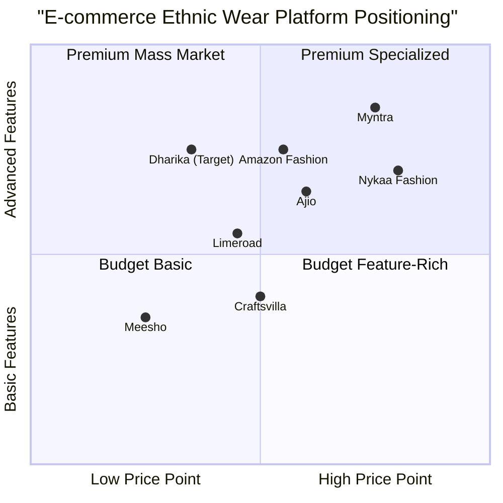

# Dharika E-commerce Platform - Product Requirements Document (PRD)

**Prepared by:** Saiyam Kumar (Co-founder @Dharika)  
**Date:** June 21, 2025


## 1. Project Information

**Language:** English  
**Programming Language:** Shadcn-ui, TypeScript, Tailwind CSS  
**Project Name:** Dharika  
**Launch Timeline:** 10-15 days  

### Original Requirements Restatement
Dharika is an e-commerce website for a budget-friendly, mass-market ethnic wear brand primarily focused on Indian women's fashion, with future expansion into men's fashion. The platform requires a web-based solution that is both mobile-responsive and desktop-optimized, featuring product catalog with filters, user accounts, cart functionality, wishlists, gamified runner game, light CMS, payment integration (Razorpay & COD), affiliate tracking, third-party integrations, AI-powered suggestions, and a clean UI with minimal Indian traditional elements using pastel and regal color palettes.

## 2. Product Definition

### 2.1 Product Goals

1. **Market Penetration Goal**: Establish Dharika as a trusted, budget-friendly ethnic wear destination for Indian women by delivering an intuitive shopping experience with competitive pricing and engaging gamification features.

2. **User Engagement Goal**: Maximize customer retention and repeat purchases through collaborative wishlists, AI-powered recommendations, and a branded runner game that rewards users with discounts and creates community engagement.

3. **Operational Efficiency Goal**: Streamline business operations with an integrated lightweight CMS, automated inventory management, affiliate tracking system, and seamless payment processing to reduce manual overhead and scale efficiently.

### 2.2 User Stories

**US001 - Product Discovery**  
As a fashion-conscious Indian woman on a budget, I want to browse ethnic wear with intuitive filters (color, size, category, price) so that I can quickly find outfits that match my style preferences and budget constraints.

**US002 - Social Shopping Experience**  
As a user planning for festivals or weddings, I want to create collaborative wishlists that I can share with friends and family so that we can coordinate our outfit choices and get feedback before making purchases.

**US003 - Gamified Engagement**  
As a regular customer, I want to play the brand-themed runner game and compete on monthly leaderboards so that I can earn discount rewards while having fun and staying engaged with the brand.

**US004 - Seamless Checkout**  
As a first-time buyer, I want my cart to be automatically saved and receive gentle reminders so that I don't lose my selected items and can complete my purchase when convenient.

**US005 - AI-Assisted Shopping**  
As someone who often feels overwhelmed by choices, I want AI-powered suggestions in my wishlists and through style quizzes so that I can discover new products that match my taste and are currently in stock.

### 2.3 Competitive Analysis

**1. Myntra**
- *Pros*: Extensive catalog, strong mobile app, established brand trust, robust logistics
- *Cons*: Premium pricing, overwhelming UI for budget shoppers, limited gamification

**2. Ajio**
- *Pros*: Competitive pricing, good ethnic wear selection, regular sales
- *Cons*: Complex navigation, limited social features, inconsistent quality perception

**3. Nykaa Fashion**
- *Pros*: Curated ethnic collections, beauty integration, influencer partnerships
- *Cons*: Higher price points, limited budget options, complex product discovery

**4. Meesho**
- *Pros*: Ultra-budget friendly, social commerce features, COD focus
- *Cons*: Quality concerns, limited brand positioning, basic UI/UX

**5. Craftsvilla**
- *Pros*: Ethnic wear specialization, artisan focus, cultural authenticity
- *Cons*: Outdated platform, limited tech innovation, slow user experience

**6. Limeroad**
- *Pros*: Social shopping features, style boards, user-generated content
- *Cons*: Declining market presence, limited inventory, poor mobile experience

**7. Amazon Fashion (Ethnic Wear)**
- *Pros*: Massive inventory, reliable logistics, competitive pricing
- *Cons*: Generic experience, overwhelming choices, limited ethnic wear specialization


### 2.4 Competitive Quadrant Chart



## 3. Technical Specifications

### 3.1 Requirements Analysis

The Dharika e-commerce platform requires a comprehensive web-based solution that balances budget constraints with feature-rich functionality. The technical architecture must support:

**Core E-commerce Functionality**
- Product catalog management with advanced filtering and search capabilities
- User account system with progressive registration at checkout
- Shopping cart with persistent storage and abandonment recovery
- Wishlist system supporting collaboration and optional public sharing
- Multi-payment gateway integration (Razorpay, COD with fees)

**Engagement & Gamification**
- Custom runner game with monthly leaderboards and reward system
- AI-powered product recommendations with inventory awareness
- Interactive style quizzes for personalized suggestions
- Social sharing capabilities for wishlists and products

**Content Management & Operations**
- Lightweight CMS for content and inventory management
- Affiliate tracking system with coupon management
- Integration capabilities with WhatsApp, Instagram, Canva, Google Analytics
- Automated cart reminder and notification system

**Performance & Scalability**
- Mobile-first responsive design optimized for Indian market
- Fast loading times suitable for varying internet speeds
- Budget-friendly hosting compatibility (Hostinger/Netlify)
- Scalable architecture to support future expansion

### 3.2 Requirements Pool

#### P0 Requirements (Must-Have)

**REQ-001: Product Catalog System**
- Must implement product listing with image, title, price, description
- Must support filtering by category, color, size, price range
- Must include search functionality with relevance ranking
- Must support product variants (size, color) with inventory tracking

**REQ-002: User Account Management**
- Must trigger account creation during checkout process
- Must support email/phone authentication
- Must maintain user profile with order history
- Must implement password reset functionality

**REQ-003: Shopping Cart & Checkout**
- Must persist cart across sessions using localStorage/cookies
- Must calculate taxes, shipping, COD fees automatically
- Must integrate Razorpay payment gateway
- Must support Cash on Delivery with additional fees

**REQ-004: Order Management**
- Must generate unique order IDs and confirmations
- Must send order confirmation emails/SMS
- Must track order status (pending, confirmed, shipped, delivered)
- Must support basic order cancellation

**REQ-005: Responsive Design**
- Must be mobile-first and responsive across all devices
- Must load within 3 seconds on 3G connections
- Must follow accessibility guidelines (WCAG 2.1)
- Must implement Indian traditional aesthetic with pastel/regal colors

#### P1 Requirements (Should-Have)

**REQ-006: Wishlist System**
- Should support personal wishlists with add/remove functionality
- Should enable collaborative wishlists with sharing capabilities
- Should provide optional public wishlist visibility
- Should integrate AI suggestions within wishlists

**REQ-007: Gamification - Runner Game**
- Should implement brand-themed endless runner game
- Should maintain monthly leaderboards with user rankings
- Should provide discount rewards based on game performance
- Should track user engagement metrics

**REQ-008: AI-Powered Recommendations**
- Should provide personalized product suggestions
- Should implement style quiz with recommendation engine
- Should ensure recommendations only include in-stock items
- Should learn from user behavior and preferences

**REQ-009: Content Management System**
- Should provide lightweight CMS for internal team
- Should support content updates (banners, promotions)
- Should enable inventory management and product updates
- Should maintain audit trail for all changes

**REQ-010: Integration Suite**
- Should integrate with Google Analytics for tracking
- Should support WhatsApp sharing for products
- Should enable Instagram integration for social proof
- Should connect with Canva for design asset management

#### P2 Requirements (Nice-to-Have)

**REQ-011: Advanced Features**
- May implement product video support on product pages
- May add image zoom functionality
- May support customer reviews and ratings
- May include size guide and fit recommendations

**REQ-012: Marketing & Analytics**
- May implement affiliate tracking with detailed analytics
- May support coupon code system with usage limits
- May add cart abandonment email automation
- May include advanced user behavior analytics

### 3.3 UI Design Draft

#### Homepage Layout
```
┌─────────────────────────────────────────┐
│ Header: Logo | Search | Cart | Account │
├─────────────────────────────────────────┤
│ Hero Section: Looping Brand Videos      │
├─────────────────────────────────────────┤
│ Category Navigation Bar                 │
├─────────────────────────────────────────┤
│ Featured Products Grid (4x2)           │
├─────────────────────────────────────────┤
│ Game Access Button & Leaderboard       │
├─────────────────────────────────────────┤
│ Footer: Links | Social | Contact       │
└─────────────────────────────────────────┘
```

#### Product Listing Page
```
┌─────────────────┬───────────────────────┐
│ Filters Panel   │ Product Grid          │
│ - Category      │ ┌─────┬─────┬─────┐   │
│ - Price Range   │ │ Img │ Img │ Img │   │
│ - Color         │ │Title│Title│Title│   │
│ - Size          │ │Price│Price│Price│   │
│ - Availability  │ └─────┴─────┴─────┘   │
│                 │ [Load More Products]  │
└─────────────────┴───────────────────────┘
```

#### Product Detail Page
```
┌─────────────────┬───────────────────────┐
│ Image Gallery   │ Product Information   │
│ - Main Image    │ - Title & Brand       │
│ - Thumbnails    │ - Price & Discounts   │
│ - Zoom Feature  │ - Size Selector       │
│ - Video (opt)   │ - Color Options       │
│                 │ - Add to Cart/Wish    │
│                 │ - Share Options       │
└─────────────────┴───────────────────────┘
│ AI Recommendations | Related Products   │
└─────────────────────────────────────────┘
```

### 3.4 Database Schema

#### Core Tables

**Users Table**
```sql
users {
  id: UUID PRIMARY KEY
  email: VARCHAR(255) UNIQUE
  phone: VARCHAR(15)
  password_hash: VARCHAR(255)
  first_name: VARCHAR(100)
  last_name: VARCHAR(100)
  created_at: TIMESTAMP
  updated_at: TIMESTAMP
  is_verified: BOOLEAN DEFAULT false
  game_score: INTEGER DEFAULT 0
}
```

**Products Table**
```sql
products {
  id: UUID PRIMARY KEY
  sku: VARCHAR(50) UNIQUE
  name: VARCHAR(255)
  description: TEXT
  category_id: UUID REFERENCES categories(id)
  base_price: DECIMAL(10,2)
  sale_price: DECIMAL(10,2)
  images: JSON
  video_url: VARCHAR(500)
  is_active: BOOLEAN DEFAULT true
  created_at: TIMESTAMP
  updated_at: TIMESTAMP
  tags: VARCHAR(500)
}
```

**Product Variants Table**
```sql
product_variants {
  id: UUID PRIMARY KEY
  product_id: UUID REFERENCES products(id)
  size: VARCHAR(10)
  color: VARCHAR(50)
  stock_quantity: INTEGER
  additional_price: DECIMAL(10,2) DEFAULT 0
  is_available: BOOLEAN DEFAULT true
}
```

**Categories Table**
```sql
categories {
  id: UUID PRIMARY KEY
  name: VARCHAR(100)
  slug: VARCHAR(100) UNIQUE
  parent_id: UUID REFERENCES categories(id)
  description: TEXT
  is_active: BOOLEAN DEFAULT true
}
```

**Carts Table**
```sql
carts {
  id: UUID PRIMARY KEY
  user_id: UUID REFERENCES users(id)
  product_variant_id: UUID REFERENCES product_variants(id)
  quantity: INTEGER
  added_at: TIMESTAMP
  updated_at: TIMESTAMP
}
```

**Wishlists Table**
```sql
wishlists {
  id: UUID PRIMARY KEY
  user_id: UUID REFERENCES users(id)
  name: VARCHAR(100)
  is_collaborative: BOOLEAN DEFAULT false
  is_public: BOOLEAN DEFAULT false
  share_token: VARCHAR(255) UNIQUE
  created_at: TIMESTAMP
}
```

**Wishlist Items Table**
```sql
wishlist_items {
  id: UUID PRIMARY KEY
  wishlist_id: UUID REFERENCES wishlists(id)
  product_id: UUID REFERENCES products(id)
  added_by: UUID REFERENCES users(id)
  added_at: TIMESTAMP
}
```

**Orders Table**
```sql
orders {
  id: UUID PRIMARY KEY
  user_id: UUID REFERENCES users(id)
  order_number: VARCHAR(50) UNIQUE
  total_amount: DECIMAL(10,2)
  payment_method: ENUM('razorpay', 'cod')
  payment_status: ENUM('pending', 'paid', 'failed')
  order_status: ENUM('pending', 'confirmed', 'shipped', 'delivered', 'cancelled')
  shipping_address: JSON
  created_at: TIMESTAMP
  updated_at: TIMESTAMP
}
```

**Game Scores Table**
```sql
game_scores {
  id: UUID PRIMARY KEY
  user_id: UUID REFERENCES users(id)
  score: INTEGER
  level_reached: INTEGER
  coins_earned: INTEGER
  play_date: TIMESTAMP
  month_year: VARCHAR(7) -- Format: 2024-01
}
```

### 3.5 API Routes Architecture

#### Authentication Routes
```
POST /api/auth/register
POST /api/auth/login
POST /api/auth/logout
POST /api/auth/forgot-password
POST /api/auth/reset-password
GET  /api/auth/verify-email/:token
```

#### Product Routes
```
GET    /api/products                 # List products with filters
GET    /api/products/:id             # Get single product
GET    /api/products/:id/variants    # Get product variants
GET    /api/products/search          # Search products
GET    /api/products/recommendations # AI recommendations
```

#### Cart Routes
```
GET    /api/cart                     # Get user cart
POST   /api/cart/add                 # Add item to cart
PUT    /api/cart/update/:id          # Update cart item
DELETE /api/cart/remove/:id          # Remove cart item
DELETE /api/cart/clear               # Clear entire cart
```

#### Wishlist Routes
```
GET    /api/wishlists                # Get user wishlists
POST   /api/wishlists                # Create wishlist
GET    /api/wishlists/:id            # Get specific wishlist
POST   /api/wishlists/:id/items      # Add item to wishlist
DELETE /api/wishlists/:id/items/:itemId # Remove item
GET    /api/wishlists/shared/:token  # Access shared wishlist
```

#### Order Routes
```
POST   /api/orders                   # Create order
GET    /api/orders                   # Get user orders
GET    /api/orders/:id               # Get specific order
PUT    /api/orders/:id/cancel        # Cancel order
```

#### Payment Routes
```
POST   /api/payments/razorpay/create # Create Razorpay order
POST   /api/payments/razorpay/verify # Verify payment
POST   /api/payments/cod/confirm     # Confirm COD order
```

#### Game Routes
```
POST   /api/game/score               # Submit game score
GET    /api/game/leaderboard         # Get monthly leaderboard
GET    /api/game/user-stats          # Get user game statistics
POST   /api/game/claim-reward        # Claim discount reward
```

### 3.6 Component Architecture

#### Core Components
```
src/
├── components/
│   ├── common/
│   │   ├── Header.tsx
│   │   ├── Footer.tsx
│   │   ├── SearchBar.tsx
│   │   ├── LoadingSpinner.tsx
│   │   └── ErrorBoundary.tsx
│   ├── product/
│   │   ├── ProductCard.tsx
│   │   ├── ProductGrid.tsx
│   │   ├── ProductDetail.tsx
│   │   ├── ProductFilter.tsx
│   │   └── ProductImageGallery.tsx
│   ├── cart/
│   │   ├── CartDrawer.tsx
│   │   ├── CartItem.tsx
│   │   └── CartSummary.tsx
│   ├── wishlist/
│   │   ├── WishlistCard.tsx
│   │   ├── WishlistManager.tsx
│   │   └── ShareWishlist.tsx
│   ├── game/
│   │   ├── RunnerGame.tsx
│   │   ├── Leaderboard.tsx
│   │   └── GameRewards.tsx
│   ├── auth/
│   │   ├── LoginForm.tsx
│   │   ├── RegisterForm.tsx
│   │   └── ForgotPassword.tsx
│   └── ai/
│       ├── StyleQuiz.tsx
│       ├── Recommendations.tsx
│       └── SmartSuggestions.tsx
```

### 3.7 Technology Stack

#### Frontend
- **Framework**: Next.js 14 with App Router
- **UI Library**: Shadcn-ui components
- **Styling**: Tailwind CSS with custom Indian theme
- **State Management**: Zustand for client state
- **Forms**: React Hook Form with Zod validation
- **Authentication**: NextAuth.js
- **Game Engine**: Phaser.js for runner game

#### Backend
- **Runtime**: Node.js with TypeScript
- **Database**: PostgreSQL with Prisma ORM
- **Authentication**: JWT tokens
- **File Storage**: Cloudinary for images/videos
- **Payment**: Razorpay SDK
- **Email**: Resend for transactional emails
- **SMS**: Twilio for OTP/notifications

#### Deployment & Hosting
- **Frontend**: Netlify/Vercel
- **Backend**: Railway/Render (budget-friendly)
- **Database**: Supabase/Railway PostgreSQL
- **CDN**: Cloudflare for static assets
- **Monitoring**: Sentry for error tracking

### 3.8 Open Questions

1. **AI Recommendation Engine**: Should we implement a custom ML model or use a third-party recommendation service like Recombee? What's the budget allocation for AI features?

2. **Inventory Management**: Do we need real-time inventory updates, or is batch processing acceptable? How should we handle overselling scenarios?

3. **Game Monetization**: Should the runner game have in-app purchases, or should it be purely engagement-driven with discount rewards only?

4. **Affiliate System**: What commission structure should be implemented? Do we need detailed affiliate analytics and reporting?

5. **Scalability Timeline**: At what user/order volume should we plan to migrate from budget hosting to more robust infrastructure?

6. **Content Localization**: Should the platform support multiple Indian languages initially, or start with English only?

7. **Social Features**: Should we implement user-generated content like reviews, photos, or social login options?

8. **Mobile App**: What's the timeline for developing native mobile apps, and should the web platform be designed to support PWA conversion?

---

*This PRD serves as the technical foundation for Dharika's development. All stakeholders should review and approve before development commences.*
